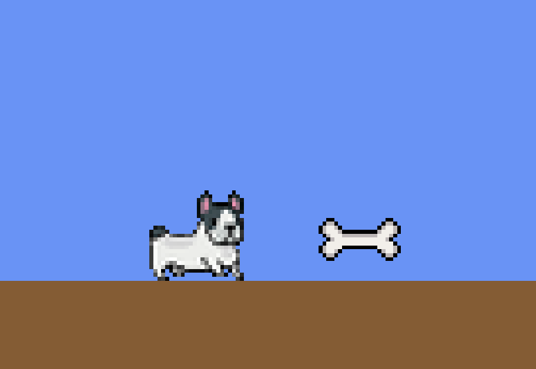

# Buldog 8-Bit

An 8-bit, Mario-style 2D platformer starring a stubby, determined bulldog on his
way home. Built with **Phaser 3** and **Vite** in plain JavaScript.



> **Status: work in progress.** The core loop is playable today — run, jump,
> collect, stomp, take damage — and the first full level is being assembled
> around it. See
> [Current state](#current-state) for exactly what runs and what doesn't.

## Run it locally

```bash
npm install
npm run dev      # dev server with hot reload → http://localhost:5173
```

Other scripts:

| Command | What it does |
|---|---|
| `npm run build` | Bundle a release into `dist/` |
| `npm run preview` | Serve the built release locally |
| `npm run lint` | ESLint |
| `npm run test` | Vitest unit suite |

## Controls

| Input | Action |
|---|---|
| ← / → | Run |
| Space | Jump — press again mid-air for a **double jump** |
| Enter | Start a new run from the Game Over screen |
| F (or the on-screen button) | Toggle fullscreen |
| C | *Dev key:* cycle the bulldog's color (white → black → red) |
| R | *Dev key:* respawn the bones and the enemy, and reset the score (hearts are untouched) |

The `C` and `R` keys are temporary stand-ins that let features be tested before
the title screen and HUD exist; they come out when those land.

## Current state

**Playable now**
- 320×240 canvas, crisp pixel-art rendering, scaled to fit any window plus a
  fullscreen toggle.
- Run, turn, jump, and double jump against Arcade physics gravity, with a
  hand-tuned hitbox that keeps the dog's feet on the ground.
- Animated hero sprite — idle / run / jump — with facing that holds while
  standing still or jumping straight up.
- Three selectable bulldog colors, applied as a sprite tint.
- **Small Bone** collectibles with a bobbing animation and an 8-bit pickup blip.
- **One arcade score, in points** — a bone is +100 and stomping an enemy +200,
  both feeding a single `SCORE`. Deliberately one number rather than two
  metrics: that's what the player is judged by, and what a scoreboard can sort.
- **A HUD that looks the part** — hearts top-left, a zero-padded `SCORE 000400`
  top-right, and every character in the game set in **Press Start 2P**, the
  arcade pixel font (vendored under the SIL OFL — no npm package, no CDN).
- A **patrolling enemy** that turns at the ends of its range and on obstacles,
  and dies to a **stomp** from above — knocked away Mario-style, arcing up and
  falling through the floor while the player bounces off its head.
- **3 hearts**, and the damage rule behind them: touching an enemy costs one
  heart and **restarts the level from the beginning**, with the reduced count
  carrying over — never refilled. There are deliberately no invulnerability
  frames; the restart is what takes you out of danger. At 0 hearts the run ends
  on a Game Over screen.

**Next up (the Alpha slice)**
- A hurt frame for the bulldog, nickname entry on a start screen, and one
  assembled level ending in a results window (which replaces today's
  placeholder Game Over screen).

**Later (Beta)**
- Levels 2–3 and their narrative endings, the Energy system and special abilities
  (Bulldog Rush, High Jump, Fart Attack, Crawl), more enemy types, the Giant Cat
  boss, music and a full SFX pass, and an online scoreboard.

The full design lives in [CLAUDE.md](CLAUDE.md); the requirements catalog is
[Bulldog-8Bit-WBS.md](Bulldog-8Bit-WBS.md) and the build tracker is
[Bulldog-8Bit-Checklist.md](Bulldog-8Bit-Checklist.md).

## How this project is built

This is a hobby game, but it's run like a real product — that's half the point of
it. Every feature goes through the same loop:

1. **Spec first.** A short requirements doc in [`specs/`](specs/) with numbered
   acceptance criteria, approved before anything else.
2. **Plan + risk rating.** The approach is written down and rated by *how many
   assumptions it rests on* — the point is to surface a shaky spec before code
   gets written, not after.
3. **Technical design.** A `## Technical design` section inside that same spec:
   files touched, module boundaries, data flow, what gets reused, the test plan.
4. **Implement** on a short-lived feature branch, trunk-based, with green
   `lint` / `test` / `build`.
5. **Playtest and review**, then a PR into `main`. Nothing lands on `main`
   directly.

**Testing strategy.** Unit tests cover *pure logic only* — movement and jump
rules, scoring, health/heart rules, enemy patrol and the stomp-vs-hit decision,
animation-state selection — which is why that logic is
deliberately pulled out of Phaser's `update()` into plain modules under
[`src/physics/`](src/physics/) and [`src/state/`](src/state/). The Phaser Scene
stays a thin adapter: it reads input, calls the tested rules, applies the result.
Rendering and scene lifecycle aren't unit-tested; whether a jump *feels* right is
decided by playtesting, not assertions. Currently **97 tests** across 6 files.

**CI.** GitHub Actions runs install → lint → test → build on every push and PR to
`main` ([`.github/workflows/ci.yml`](.github/workflows/ci.yml)).

**A small, deliberate stack.** Phaser 3, Vite, plain ES modules, Vitest, ESLint —
and a standing rule that any new dependency has to be justified before it's added.

## Project layout

```
├─ index.html              # Hosts the game canvas
├─ src/
│  ├─ main.js              # Phaser config + the scene (thin adapter over the rules)
│  ├─ physics/             # Pure, unit-tested rules: player.js, animation.js, enemy.js
│  ├─ state/               # Pure, unit-tested state: score.js, health.js, color-select.js
│  ├─ ui/                  # Shared typography (the pixel font + text styles)
│  └─ assets/              # Sprite sheets, audio, and the vendored font
├─ specs/                  # One spec per feature (+ _TEMPLATE.md)
├─ .github/workflows/ci.yml
├─ CLAUDE.md               # Full game design + engineering conventions
├─ Bulldog-8Bit-WBS.md     # Requirements catalog (Epic > Feature, Alpha/Beta tags)
└─ Bulldog-8Bit-Checklist.md
```

## License

All rights reserved. The code and art here are published for viewing as a
portfolio piece, not for reuse.
